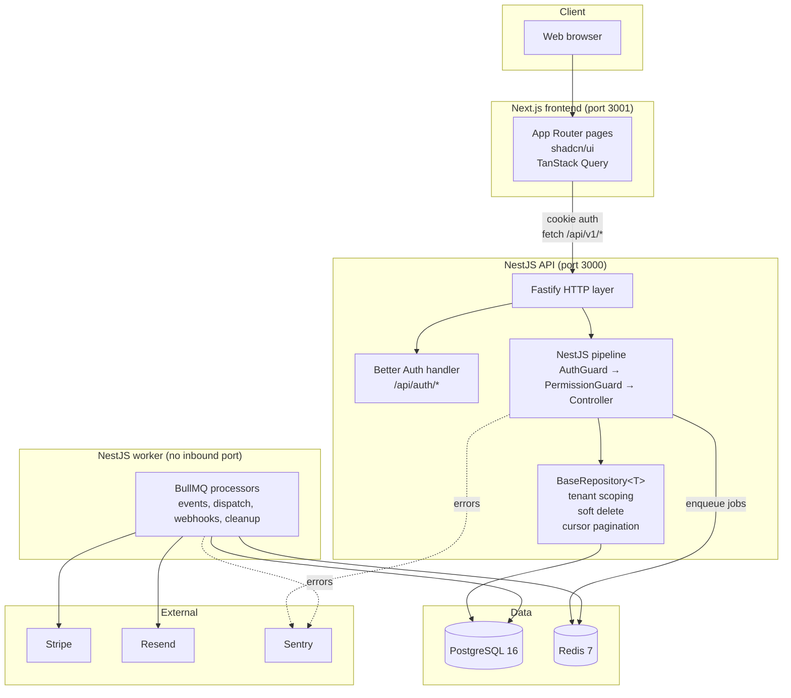
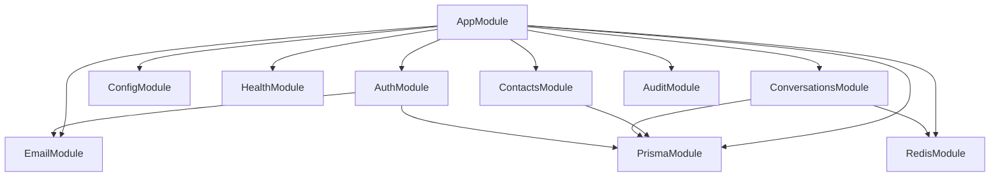

wa'kijo is a **modular monolith**, not a microservice constellation. One
NestJS API, one Next.js frontend, one Postgres, one Redis. Each can scale
horizontally; none can be replaced without effort.

This page is the customer-facing architecture overview. The deeper
internal version with file paths and code snippets lives in the repo at
[`docs/architecture.md`](https://github.com/wakijo/wa-kijo/blob/main/docs/architecture.md).

## The high-level picture



## Request lifecycle

Every authenticated HTTP request follows this exact pipeline:

<Steps>
  <Step title="Fastify hook #1 — context init">
    `AsyncLocalStorage.run({ requestId, userId: '', orgId: '', ... })`
    wraps the async chain. Every downstream `await` inherits the store.
  </Step>
  <Step title="Fastify hook #2 — Better Auth shortcut">
    Routes matching `/api/auth/*` are forwarded to Better Auth's
    `toNodeHandler`. Better Auth reads the raw body, sets cookies, and
    returns. NestJS never sees these requests.
  </Step>
  <Step title="NestJS APP_GUARD #1 — AuthGuard">
    Validates the session cookie via Better Auth, then calls
    `AuthService.resolveContext()` to populate the AsyncLocalStorage
    store with `userId`, `orgId`, `userRole`. Routes decorated `@Public()`
    skip this guard.
  </Step>
  <Step title="NestJS APP_GUARD #2 — PermissionGuard">
    Reads `@RequirePermission('resource:action')` metadata and checks
    `PERMISSIONS[permission].includes(ctx.userRole)`. Routes without the
    decorator are open to any authenticated user.
  </Step>
  <Step title="Controller">
    `@CurrentUser()` injects the `RequestContext`. Calls service methods.
  </Step>
  <Step title="Service → Repository">
    Service calls repository methods. The repository extends
    `BaseRepository<T>` which automatically scopes every Prisma query to
    `ctx.orgId`.
  </Step>
  <Step title="TransformInterceptor">
    Wraps the controller's return value in
    `{ success: true, data, timestamp }`.
  </Step>
</Steps>

The same `RequestContext` is available everywhere via the
`getRequestContext()` helper — no prop-drilling.

## Why these choices

The single biggest principle: **make tenant safety the default**.

| Choice | Why |
|---|---|
| Fastify over Express | ~2× throughput; cleaner hook ordering for Better Auth's raw-body needs ([ADR-0003](https://github.com/wakijo/wa-kijo/blob/main/docs/decisions/0003-fastify-over-express.md)) |
| Better Auth over custom auth | Sessions, password hashing, OAuth, magic links — all library-owned and audited. We don't write crypto ([ADR-0001](https://github.com/wakijo/wa-kijo/blob/main/docs/decisions/0001-better-auth-with-org-hierarchy.md)) |
| AsyncLocalStorage over REQUEST-scoped DI | Avoids forcing all transitive providers into REQUEST scope (expensive at Fastify's concurrency) |
| BaseRepository over raw Prisma | Tenant scoping enforced at the data layer ([ADR-0005](https://github.com/wakijo/wa-kijo/blob/main/docs/decisions/0005-base-repository-tenant-scoping.md)) |
| Zod end-to-end | Single source of truth for DTOs across API + frontend ([ADR-0004](https://github.com/wakijo/wa-kijo/blob/main/docs/decisions/0004-zod-end-to-end.md)) |
| Permissions as a static catalogue in `@wa-kijo/shared` | Both API enforcement and frontend UX read from one file |
| BullMQ + Redis | Battle-tested; integrates cleanly with NestJS DI ([ADR-0007](https://github.com/wakijo/wa-kijo/blob/main/docs/decisions/0007-bullmq-for-background-jobs.md)) |
| pnpm monorepo with `apps/*` and `packages/*` | One install; shared code is source-first; familiar layout ([ADR-0002](https://github.com/wakijo/wa-kijo/blob/main/docs/decisions/0002-pnpm-monorepo.md)) |

## Response envelope

Every non-`/health`, non-`/api/auth` endpoint returns one of:

```jsonc
// Success
{
  "success": true,
  "data": { ... },
  "timestamp": "2026-05-02T08:30:00.000Z"
}

// Error
{
  "success": false,
  "statusCode": 422,
  "error": "VALIDATION_ERROR",
  "message": "Validation failed",
  "details": { "fieldErrors": { "phone": ["Invalid E.164 format"] } },
  "timestamp": "2026-05-02T08:30:00.000Z",
  "path": "/api/v1/contacts"
}
```

Stable error codes are listed at [Reference → Error codes](/reference/error-codes).

## Frontend ↔ API contract

The Next.js frontend talks to the API exclusively over HTTP. There is
**no shared server process**. They cannot share `process.memory` and
they don't need to — the contract is the OpenAPI spec, served live at
`http://localhost:3000/api/docs` and frozen as a snapshot at
[`docs/api/openapi.yaml`](https://github.com/wakijo/wa-kijo/blob/main/docs/api/openapi.yaml).

Frontend data fetching pattern:

```ts
// TanStack Query + auth-aware fetcher
const { data } = useQuery({
  queryKey: ['contacts', orgId],
  queryFn: () => fetcher<ContactList>('/api/v1/contacts'),
});
```

`fetcher` always sends `credentials: 'include'`, redirects to `/sign-in`
on 401, and throws a typed `ApiError` on non-2xx responses.

## Dependency graph (modules)



`PrismaModule`, `RedisModule`, and `ConfigModule` are `@Global` so every
feature module gets them without explicit imports.

## What to read next

<CardGroup cols={2}>
  <Card title="Multi-tenancy" icon="building" href="/concepts/multi-tenancy">
    The 3-level org hierarchy and how role inheritance works.
  </Card>
  <Card title="Authentication" icon="key" href="/concepts/authentication">
    Sessions, magic links, OAuth, MFA roadmap.
  </Card>
  <Card title="RBAC" icon="shield" href="/concepts/rbac">
    Permissions catalogue, server enforcement, frontend UX.
  </Card>
  <Card title="Data model" icon="database" href="/concepts/data-model">
    Prisma schema, soft delete, audit fields, indexing.
  </Card>
</CardGroup>
