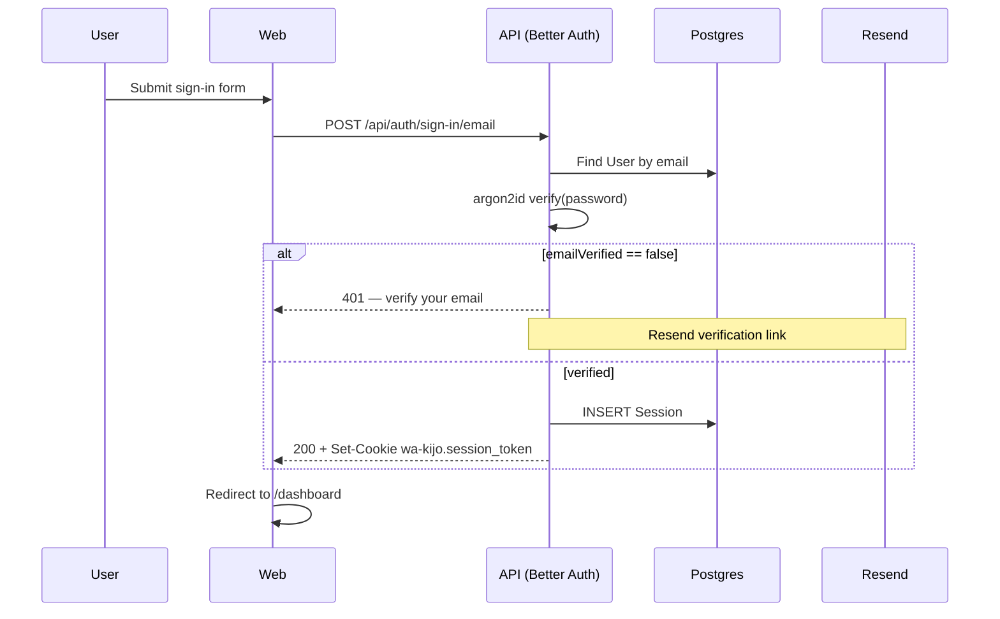
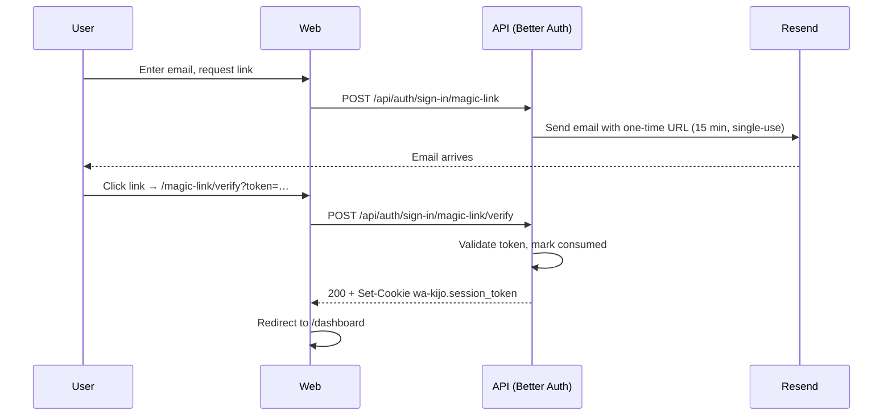

wa'kijo uses [Better Auth](https://better-auth.com) ≥1.5 for everything
auth-related. Better Auth owns password hashing (argon2id), session
management, OAuth flows, magic links, email verification, password
resets, and the underlying database adapter. We do not write crypto.

## What's enabled by default

| Method | Status | Notes |
|---|---|---|
| Email + password sign-up & sign-in | ✅ | Email verification required before first sign-in |
| Magic-link sign-in | ✅ | 15-minute expiry, single-use |
| Password reset via email | ✅ | 30-minute reset link |
| Google OAuth | ✅ | Optional — gated by `GOOGLE_CLIENT_ID` and `GOOGLE_CLIENT_SECRET` |
| Active session list (sign-out per device) | ✅ | `/settings/sessions` |
| TOTP MFA | Planned 1.0 | Roadmap |
| Passkey (WebAuthn) | Planned 1.1 | Roadmap |

Add another method at any time by enabling its Better Auth plugin and
adding a UI page under `apps/web/src/app/(auth)/`.

## Where it's mounted

Better Auth runs as a **Fastify handler** before the NestJS pipeline:

```
HTTP request
   │
   ├─ /api/auth/*  →  Fastify hook → Better Auth toNodeHandler → returns reply
   │                  (NestJS never sees these requests)
   │
   └─ everything else → NestJS pipeline → AuthGuard reads cookie → resolves context
```

This is necessary because Better Auth needs the **raw request body** —
NestJS's body parser would consume it first. The hook also sets CORS
headers manually because Better Auth writes directly to
`reply.raw.setHeader`, bypassing Fastify's header layer.

The full rationale lives in [ADR-0001](https://github.com/wakijo/wa-kijo/blob/main/docs/decisions/0001-better-auth-with-org-hierarchy.md)
and [ADR-0003](https://github.com/wakijo/wa-kijo/blob/main/docs/decisions/0003-fastify-over-express.md).

## Session model

| Setting | Value |
|---|---|
| Storage | HttpOnly cookie + server-side `Session` row in Postgres |
| Cookie name | `wa-kijo.session_token` |
| Expiry | 30 days, **sliding** (renews every 24 h on activity) |
| Flags | `HttpOnly`, `SameSite=Lax`, `Secure` (production only) |
| Cookie cache | 5 minutes — Better Auth skips DB lookup on cached sessions |
| Multi-device | Each session is its own row; sign-out is per device |

Sessions can be revoked from the user's `/settings/sessions` page or by
deleting the row in Prisma Studio.

## Sign-in flows

### Email + password



### Magic link



### Google OAuth

Standard OAuth 2.0 authorisation code flow with PKCE. Disabled if
`GOOGLE_CLIENT_ID` and `GOOGLE_CLIENT_SECRET` env vars are not set.
Other OAuth providers (GitHub, Microsoft, Apple) require enabling the
relevant Better Auth plugin.

## Email verification

By default, **users must verify their email before they can sign in**.
This is enforced by Better Auth and not by application code. The flow:

1. User signs up.
2. wa'kijo's `EmailService.sendVerification()` is called via the Better
   Auth `sendVerificationEmail` hook.
3. User clicks the link → `/api/auth/verify-email?token=…`.
4. Better Auth marks `User.emailVerified = true`.
5. User can now sign in.

To disable verification (e.g. for an internal tool), set
`requireEmailVerification: false` in `apps/api/src/auth/auth.module.ts`.
Don't disable it for production B2B SaaS — verified email is the
foundation of password recovery and member invitation flows.

## Resolving the request context

Once Better Auth has established a session, every NestJS request runs
through `AuthGuard`:

```ts
// Simplified — see apps/api/src/common/guards/auth.guard.ts
async canActivate(ctx) {
  const req = ctx.switchToHttp().getRequest();
  const session = await this.auth.api.getSession({ headers: req.headers });
  if (!session) throw new UnauthorizedException();

  const fullContext = await this.authService.resolveContext(session);
  // mutate the AsyncLocalStorage store with userId, orgId, userRole, ...
  return true;
}
```

`resolveContext()` returns:

| Field | What |
|---|---|
| `requestId` | Per-request UUID generated by Fastify |
| `userId` | Better Auth user ID |
| `orgId` | Active organisation ID from `Session.activeOrganizationId` |
| `orgType` | `SYSTEM \| AGENCY \| WORKSPACE` |
| `userRole` | The **effective** role (after hierarchy inheritance) |
| `globalRole` | Top-level user kind (`user` \| `admin`) — for SYSTEM operations |

Anywhere in the call chain — controller, service, repository,
processor — you can read this with `getRequestContext()` or the
`@CurrentUser()` parameter decorator.

## Rate limiting on auth

Better Auth ships with per-IP rate limiting on auth endpoints. wa'kijo's
defaults:

| Endpoint | Limit |
|---|---|
| `/api/auth/sign-in/*` | 5 attempts / 15 min / IP, then 1 hr cooldown |
| `/api/auth/sign-up` | 3 attempts / 15 min / IP |
| `/api/auth/forget-password` | 3 attempts / hour / email |

Tune in `apps/api/src/auth/auth.module.ts`. For production, also put a
WAF in front (Cloudflare, AWS WAF) — application-level rate limiting is
the second line of defence, not the first.

## Sign-out

```bash
curl -X POST -b cookies.txt http://localhost:3000/api/auth/sign-out
```

Single-device sign-out clears the current session row and the cookie.
Sign-out-from-all-devices ships in 1.0 and revokes every Session row
for the user.

## Customising

Common customisations and where they live:

| Want to | Edit |
|---|---|
| Add a new OAuth provider | `apps/api/src/auth/auth.module.ts` (Better Auth plugin), `apps/web/src/app/(auth)/sign-in/page.tsx` (button) |
| Change session duration | `betterAuth({ session: { expiresIn: ... } })` |
| Allow unverified sign-in | `betterAuth({ emailAndPassword: { requireEmailVerification: false } })` |
| Customise email templates | `apps/api/src/modules/email/templates/` |
| Add MFA before 1.0 ships it | Install Better Auth's MFA plugin and a UI page under `(auth)` |

See the full customisation guide at [Customise auth](/guides/customise-branding#auth-methods).

## Troubleshooting

<AccordionGroup>
  <Accordion title="Sign-in returns 401 with valid credentials">
    `User.emailVerified` is `false`. Either click the verification email,
    set the field manually in Prisma Studio, or re-run `pnpm db:seed`
    (seed users are created with `emailVerified: true`).
  </Accordion>
  <Accordion title="Cookie isn't being set in production">
    Ensure `BETTER_AUTH_URL` matches the public API URL exactly — no
    trailing slash, correct protocol (https). The `Secure` flag on the
    cookie requires HTTPS.
  </Accordion>
  <Accordion title="CORS error on /api/auth/*">
    The `/api/auth/*` routes need CORS set on `reply.raw` — this happens
    inside the second Fastify hook in `main.ts`. Confirm `CORS_ORIGIN`
    is set correctly in your environment.
  </Accordion>
  <Accordion title="OAuth callback URL mismatch">
    Better Auth derives the OAuth callback URL from `BETTER_AUTH_URL`.
    If you've put the API behind a reverse proxy, set `BETTER_AUTH_URL`
    to the **external** URL, not the internal one.
  </Accordion>
</AccordionGroup>
