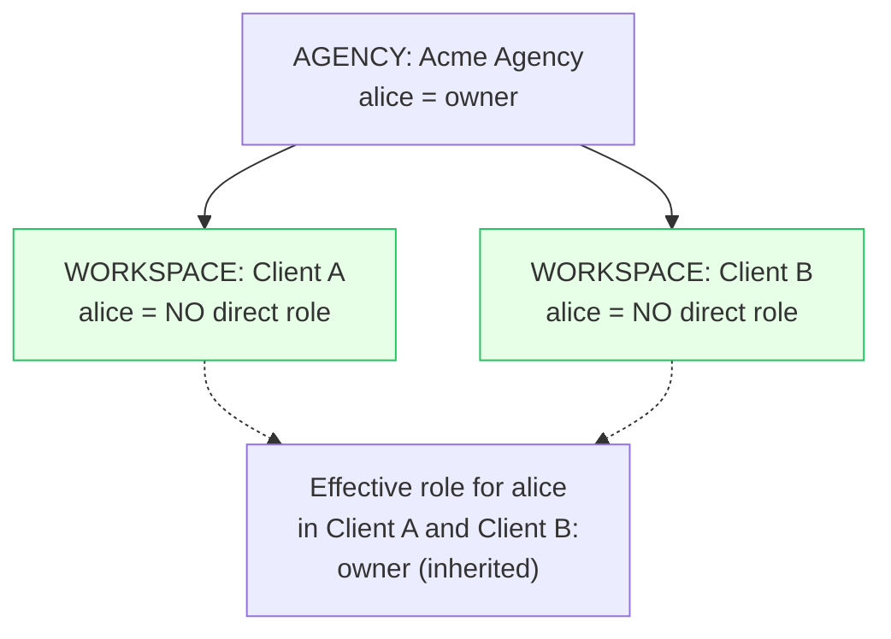

Multi-tenancy is the most important concept in wa'kijo. Get it wrong
and you leak data between customers. Get it right and you don't have to
think about it again.

## The hierarchy

wa'kijo ships with a **three-level organisation hierarchy**:

```
SYSTEM       ← the SaaS platform itself; one per installation
└── AGENCY      ← a customer managing multiple client accounts
    └── WORKSPACE  ← an individual client's working area
```

All three levels are the same Prisma model — `Organization` — distinguished
by an `orgType` field. The `parentOrgId` field links child to parent.

Why three levels?

- **Most B2B SaaS needs two:** customer accounts with their own users.
- **Agency-style products need three:** an agency manages many client
  accounts.
- **More than three is almost always a sign of conflating concepts.**
  We cap depth at 3 deliberately and document the limit.

If you only need two levels, omit AGENCY: every customer is a top-level
WORKSPACE. The hierarchy mechanics still work; the middle tier just
isn't used.

## Role inheritance

A user can be a `Member` of multiple organisations simultaneously, each
with its own role. When they sign in and pick an active org:

1. `AuthService.resolveContext()` loads their direct role in that org.
2. It walks up the `parentOrgId` chain (max 3 levels).
3. Their **highest role across the chain** becomes the active role.

Concretely: an `owner` of an AGENCY automatically has `owner` authority
in every WORKSPACE under that agency — without a duplicate `Member`
record per workspace.



Role precedence:

| Role | Numeric weight |
|---|---|
| `owner` | 30 |
| `admin` | 20 |
| `member` | 10 |

Higher numeric weight wins. If a user is `member` directly in a
WORKSPACE but `owner` of the parent AGENCY, the effective role is
`owner` — the inherited authority dominates.

## Tenant scoping at the database layer

Every domain entity has an `organizationId` (or equivalent). The
`BaseRepository<T>` automatically injects this into every query:

```ts
// Inside a controller
return this.contacts.findAll(ctx);

// Inside ContactsService → ContactsRepository → BaseRepository
const where = {
  ...this.tenantWhere(ctx),     // { organizationId: ctx.orgId }
  deletedAt: null,
  ...query.filter,
};
return this.prisma.contact.findMany({ where, ... });
```

Two consequences:

1. **Forgetting to scope is impossible** — the BaseRepository does it
   regardless of what the calling service forgot.
2. **Bypassing the scope is intentionally awkward** — you have to call
   Prisma directly with an `// EXEMPT: <reason>` comment that ESLint
   flags. This shows up in code review.

## Cross-tenant access tests

Every repository ships with an integration test asserting cross-tenant
access fails:

```ts
describe('ContactsRepository — tenant isolation', () => {
  it('cannot read contacts from another organisation', async () => {
    const orgA = await orgFixture(prisma);
    const orgB = await orgFixture(prisma);
    const contact = await prisma.contact.create({
      data: { phone: '+60123456789', name: 'Aisha', organizationId: orgA.id },
    });

    const ctxB = mockContext({ orgId: orgB.id });
    expect(await repo.findById(ctxB, contact.id)).toBeNull();
  });

  // ... and the same for update, soft-delete, list filtering
});
```

These tests run on every PR. A new module without them does not merge.

## What 404 vs 403 means here

A common subtle mistake: returning `403 Forbidden` for an out-of-tenant
resource leaks the resource's existence to an attacker. The wa'kijo
convention is to return `404 Not Found` instead — indistinguishable from
"this ID has never existed".

```ts
// In a service method
const contact = await this.repo.findById(ctx, id);
if (!contact) throw new NotFoundException('Contact not found');
//                ↑ returns 404 even if the contact exists in another org
```

This is documented in [API conventions § Tenant scoping](/reference/api/overview).

## Active organisation switching

A user with multiple memberships sees an org switcher in the top bar.
Picking a new org calls Better Auth's
`organization.setActive({ organizationId })`, which:

1. Updates the `Session.activeOrganizationId` row.
2. Invalidates Better Auth's cookie cache.
3. Subsequent API calls resolve the new org via `AuthGuard`.

The switch is essentially free — no data migration, no logout, no full
page reload required.

## Limits and trade-offs

| Limit | Value | Why |
|---|---|---|
| Max hierarchy depth | 3 | More than this indicates a data modelling problem; we enforce in `AuthService.getOrgAncestors()` |
| Max members per org | 10,000 | Soft limit; UI uses cursor pagination above this |
| Max orgs per user | unlimited | But the org switcher UI works best below ~50 |

If you genuinely need more than 3 hierarchy levels, you're either:

- Modelling project / team-level access on top of org-level access, in
  which case a separate "team" concept inside an org is the right
  pattern (Phase 6+).
- Building a network-of-networks product, in which case you've outgrown
  this boilerplate's mental model — talk to us.

## Adapting to your product

| Your product | How to use the hierarchy |
|---|---|
| Single-tenant internal tool | Use one root SYSTEM org; everything reports to it. Skip AGENCY. |
| Standard B2B SaaS | Each customer is a top-level WORKSPACE. Skip AGENCY. |
| Agency / reseller SaaS | Sign-up creates an AGENCY; customers create child WORKSPACEs under it. |
| White-label / multi-brand | Use AGENCY as "brand"; WORKSPACE as "customer of that brand". |

The default `pnpm db:seed` creates one of each so you can see the
relationships in Prisma Studio.

## What to read next

<CardGroup cols={2}>
  <Card title="Authentication" icon="key" href="/concepts/authentication">
    How sessions, OAuth, and magic links work end-to-end.
  </Card>
  <Card title="RBAC" icon="shield" href="/concepts/rbac">
    The permission catalogue and how to extend it.
  </Card>
</CardGroup>
