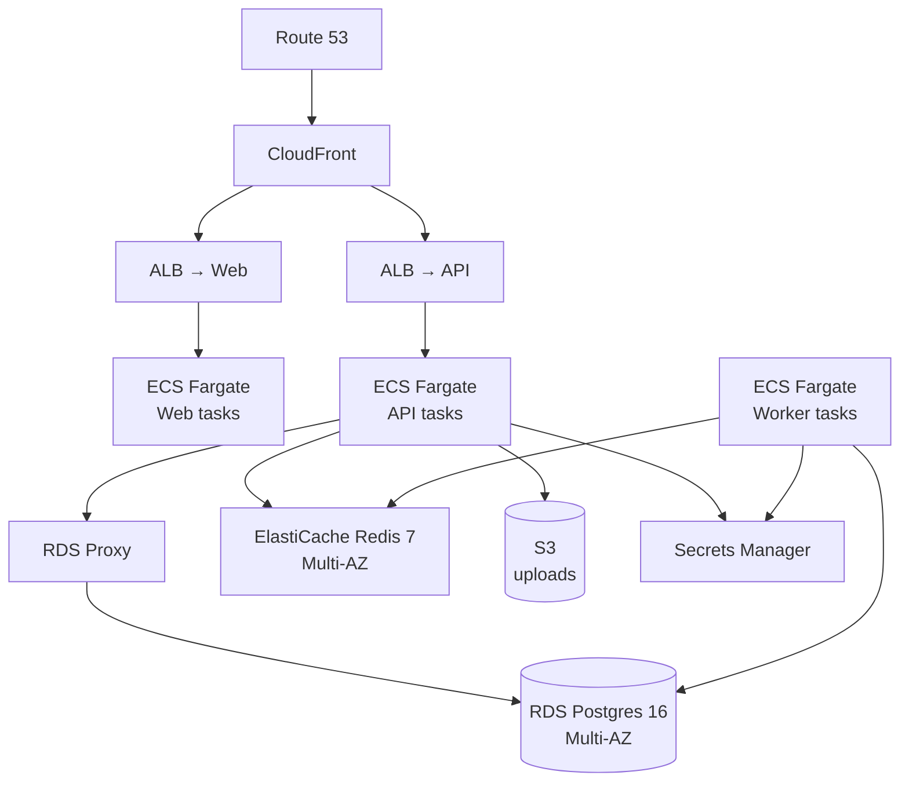

For deployments that need fine-grained scaling, multi-AZ availability,
or compliance-driven regions, AWS is the recommended target. This
guide is an opinionated reference architecture — adapt to your
organisation's standards.

Estimated setup time: **half a day for first deploy** if you're
familiar with AWS. Less with Terraform / CDK.

## Reference architecture

| Component | AWS service | Why |
|---|---|---|
| API + Worker | ECS Fargate | Container-native, no EC2 to manage |
| Web | Vercel **or** Amplify **or** ECS Fargate | Vercel is easiest if you don't need to keep web in the VPC |
| Database | RDS for PostgreSQL 16 (Multi-AZ, gp3) | Managed backups, point-in-time restore, automatic failover |
| Connection pool | RDS Proxy | Required at any meaningful scale |
| Cache + queue | ElastiCache for Redis 7 (Multi-AZ) | Automatic failover, native CloudWatch metrics |
| Email | Resend (recommended) or SES | If using SES, write an `EmailProvider` adapter |
| Object storage | S3 | Uploaded files; lifecycle rules for cleanup |
| Secrets | Secrets Manager (preferred) or SSM Parameter Store | Read at task startup; rotation supported |
| Logs | CloudWatch Logs | Pino's JSON output is parsed natively |
| Errors | Sentry | Same SDK as everywhere else |
| CDN | CloudFront in front of the web ALB | Caches static assets |



## 1. Networking

A standard 3-AZ VPC layout:

| Subnet type | CIDR (example) | Resources |
|---|---|---|
| Public | `10.0.0.0/24` × 3 | ALBs, NAT gateways |
| Private | `10.0.10.0/24` × 3 | ECS tasks |
| Data | `10.0.20.0/24` × 3 | RDS, ElastiCache |

Security groups:

- **API task SG** allows outbound to RDS Proxy SG and ElastiCache SG.
- **Worker task SG** same as API, plus outbound to S3 / Resend / Stripe.
- **RDS Proxy SG** allows inbound only from API and Worker SGs.
- **ALB SG** allows inbound 443 from `0.0.0.0/0`.

## 2. RDS Postgres

```
Engine:        PostgreSQL 16
Instance:      db.t4g.medium (start), scale up via blue/green deploy
Storage:       gp3, 100 GB initial, autoscale to 1000 GB
Multi-AZ:      enabled
Backups:       30-day retention, daily 03:00 UTC window
Encryption:    at-rest (KMS managed)
Parameters:
  max_connections: 200
  shared_preload_libraries: pg_stat_statements
```

Enable the `pgcrypto` extension after creation:

```sql
CREATE EXTENSION IF NOT EXISTS pgcrypto;
```

### RDS Proxy

```
Target group:  the RDS instance above
Auth:          IAM (recommended) or Secrets Manager
Idle client timeout:  1800 seconds
Max connections %:    100
```

The API uses the proxy endpoint with `?pgbouncer=true` appended (so
Prisma disables prepared statements). The worker uses a **direct**
connection because long-running jobs need session state.

## 3. ElastiCache Redis

```
Engine:        Redis 7
Node type:     cache.t4g.small (start)
Multi-AZ:      enabled with automatic failover
Persistence:   AOF + daily snapshot
Encryption:    at-rest + in-transit
Auth:          Redis AUTH token (rotate via Secrets Manager)
```

## 4. ECS Fargate task definitions

### Image build

Build once, deploy three task definitions from the same image. A
minimal `Dockerfile` for the API:

```dockerfile
FROM node:22-alpine AS base
WORKDIR /app
RUN corepack enable && corepack prepare pnpm@9.15.0 --activate

FROM base AS deps
COPY package.json pnpm-lock.yaml pnpm-workspace.yaml ./
COPY apps/api/package.json apps/api/
COPY packages/db/package.json packages/db/
COPY packages/shared/package.json packages/shared/
RUN pnpm install --frozen-lockfile

FROM base AS build
COPY --from=deps /app/node_modules ./node_modules
COPY --from=deps /app/apps/api/node_modules ./apps/api/node_modules
COPY --from=deps /app/packages/db/node_modules ./packages/db/node_modules
COPY --from=deps /app/packages/shared/node_modules ./packages/shared/node_modules
COPY . .
RUN pnpm --filter @wa-kijo/shared build \
 && pnpm --filter @wa-kijo/db build \
 && pnpm --filter @wa-kijo/api build

FROM base AS runtime
ENV NODE_ENV=production
COPY --from=build /app /app
EXPOSE 3000
CMD ["pnpm", "--filter", "@wa-kijo/api", "start"]
```

Push to ECR. Tag each release with the git SHA.

### Task definitions

| Task | CPU / Memory | Replica count | Command |
|---|---|---|---|
| `wakijo-api` | 1024 / 2048 | min 2, max 20 (autoscale on CPU > 60%) | default (`pnpm ... start`) |
| `wakijo-worker` | 1024 / 2048 | min 1, max 10 | `WORKER_MODE=true pnpm --filter @wa-kijo/api start` |
| `wakijo-migrate` | 1024 / 2048 | run-once | `pnpm --filter @wa-kijo/db migrate:deploy` |

The `wakijo-migrate` task runs as a **one-off** before each deploy, not
continuously. CodeDeploy / your CI runs it via `aws ecs run-task`.

### IAM task role

Minimum permissions:

```jsonc
{
  "Version": "2012-10-17",
  "Statement": [
    {
      "Effect": "Allow",
      "Action": ["secretsmanager:GetSecretValue"],
      "Resource": "arn:aws:secretsmanager:*:*:secret:wakijo/*"
    },
    {
      "Effect": "Allow",
      "Action": ["s3:GetObject", "s3:PutObject", "s3:DeleteObject"],
      "Resource": "arn:aws:s3:::wakijo-uploads-*/*"
    },
    {
      "Effect": "Allow",
      "Action": ["logs:CreateLogStream", "logs:PutLogEvents"],
      "Resource": "*"
    }
  ]
}
```

Do **not** grant broad RDS or ElastiCache management permissions —
the app only needs to connect via the URL.

## 5. Secrets

Store every secret in Secrets Manager under `wakijo/<env>/<name>`:

| Secret | Notes |
|---|---|
| `wakijo/prod/database-url` | Full Postgres URL via RDS Proxy |
| `wakijo/prod/redis-url` | `rediss://` with auth token |
| `wakijo/prod/better-auth-secret` | 32-byte base64 |
| `wakijo/prod/resend-api-key` | Resend production key |
| `wakijo/prod/stripe-secret-key` | If using Stripe |
| `wakijo/prod/stripe-webhook-secret` | If using Stripe |

In the task definition, expose them as env vars via the
`secrets` array:

```json
{
  "secrets": [
    { "name": "DATABASE_URL",        "valueFrom": "arn:aws:secretsmanager:...:wakijo/prod/database-url" },
    { "name": "BETTER_AUTH_SECRET",  "valueFrom": "arn:aws:secretsmanager:...:wakijo/prod/better-auth-secret" }
  ]
}
```

Rotate via Secrets Manager's built-in rotation; redeploy the tasks to
pick up the new value.

## 6. Load balancer

Application Load Balancer with two listener rules:

- `api.your-saas.com` → API target group
- `app.your-saas.com` → Web target group

Target group health checks:

- API: `/api/v1/health`, expect 200, every 15 s, 2 healthy / 3
  unhealthy thresholds.
- Web: `/`, expect 200.

## 7. CloudWatch + alarms

Set up the alarms from
[Concepts → Observability](/concepts/observability#recommended-alert-pack).
The CloudWatch-native ones (CPU, memory, ALB 5xx, RDS connections,
Redis memory) are clicks. The application-level ones (queue lag,
webhook signature failures) come from log metric filters on the Pino
JSON output:

```
{ $.msg = "Job failed" && $.queue = "message-dispatch" }
```

## 8. Logs

`awslogs` log driver writes Pino JSON straight into CloudWatch Logs.
Subscribe a Lambda (or Logs Insights query) to forward to your
aggregator (Datadog, Better Stack, Loki).

## 9. Backups & DR

| Layer | Cadence | Retention | Restore tested |
|---|---|---|---|
| RDS automated backups | continuous WAL | 30 days | quarterly |
| RDS daily snapshot | daily | 90 days | annually |
| Logical `pg_dump` to S3 | daily | 90 days, S3 IA after 30 days | quarterly |
| S3 uploads | versioned + lifecycle | 365 days | annually |

## 10. Deploy pipeline

Recommended: GitHub Actions → ECR → CodeDeploy (or `aws ecs
update-service`).

Sketch:

```yaml
# .github/workflows/deploy.yml (excerpt)
- name: Build & push image
  run: |
    docker build -t $ECR_URL:$GITHUB_SHA -f apps/api/Dockerfile .
    docker push $ECR_URL:$GITHUB_SHA

- name: Run migrations
  run: |
    aws ecs run-task \
      --cluster wakijo \
      --task-definition wakijo-migrate \
      --launch-type FARGATE \
      --overrides '{"containerOverrides":[{"name":"app","command":["pnpm","--filter","@wa-kijo/db","migrate:deploy"]}]}' \
      --network-configuration ...
    # poll until task exits with code 0

- name: Update services
  run: |
    aws ecs update-service --cluster wakijo --service wakijo-api    --force-new-deployment
    aws ecs update-service --cluster wakijo --service wakijo-worker --force-new-deployment
```

Health-check-gated deploys (CodeDeploy blue/green or ECS rolling)
ensure the new tasks pass `/api/v1/health` before traffic flips.

## 11. Cost guidance

Indicative monthly cost for a mid-sized SaaS (~100 paying customers,
~1k DAU):

| Component | $ / month (us-east-1) |
|---|---|
| ECS Fargate (API ×3, Worker ×1, 1 vCPU each) | ~ $90 |
| RDS db.t4g.medium Multi-AZ + 100 GB gp3 | ~ $90 |
| ElastiCache cache.t4g.small Multi-AZ | ~ $50 |
| ALB | ~ $20 |
| Data transfer (modest) | ~ $20 |
| CloudWatch Logs | ~ $20 |
| S3 + CloudFront (modest) | ~ $10 |
| **Total** | **~ $300** |

This scales sublinearly with users — you pay mostly for **availability**
on AWS, not for traffic.

## Compliance notes

- **PDPA / GDPR** — keep customer data in the appropriate region. RDS
  + ElastiCache Multi-AZ stays within the region. Don't enable
  cross-region replication without a DPA.
- **SOC 2** — AWS handles the underlying controls; you handle the
  application-level controls (audit logs, access reviews, encryption
  in transit).
- **HIPAA / PCI** — out of scope for the wa'kijo defaults; your stack
  needs additional controls (BAA with AWS, IAM granularity, dedicated
  tenancy). Talk to a specialist before claiming compliance.

## When to leave AWS

If your SaaS doesn't need any of the AWS-specific reasons above (Multi-AZ,
specific region, compliance), Railway is cheaper and operationally
simpler. Most wa'kijo customers stay on Railway through their first
$1M ARR.
