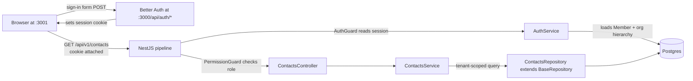

## Prerequisites

Verify you have these installed at the right versions before you start —
mismatched Node versions are the #1 cause of "it didn't work the first
time".

<CardGroup cols={3}>
  <Card title="Node.js 22 LTS" icon="node">
    `nvm install 22 && nvm use 22`
    <br />
    Verify: `node --version` returns `v22.x`.
  </Card>
  <Card title="pnpm 9" icon="cube">
    `corepack enable && corepack prepare pnpm@9.15.0 --activate`
    <br />
    Verify: `pnpm --version` returns `9.15.x`.
  </Card>
  <Card title="Docker 25+" icon="docker">
    [Install Docker Desktop](https://docs.docker.com/get-docker/) with
    Compose v2.
    <br />
    Verify: `docker compose version` runs without error.
  </Card>
</CardGroup>

## Six commands

```bash
# 1. Install dependencies (also runs prisma generate via postinstall)
pnpm install

# 2. Configure environment
cp .env.example .env
# Edit .env — at minimum set BETTER_AUTH_SECRET, RESEND_API_KEY, and EMAIL_FROM.

# 3. Start Postgres 16 + Redis 7 in Docker
pnpm docker:up

# 4. Apply database migrations
pnpm db:migrate
# When prompted for a migration name, type: init_schema

# 5. Seed dev data — three users in a 3-org hierarchy
pnpm db:seed

# 6. Start API + web with hot reload
pnpm dev
```

## URLs once it's running

<CardGroup cols={2}>
  <Card title="Web app" icon="globe">
    [http://localhost:3001](http://localhost:3001)
  </Card>
  <Card title="API" icon="server">
    [http://localhost:3000](http://localhost:3000)
  </Card>
  <Card title="Swagger UI" icon="book-open">
    [http://localhost:3000/api/docs](http://localhost:3000/api/docs)
  </Card>
  <Card title="Prisma Studio" icon="database">
    `pnpm db:studio` → [http://localhost:5555](http://localhost:5555)
  </Card>
</CardGroup>

## Sign in with seed users

`pnpm db:seed` (re-runnable) creates three users you can sign in as
straight away:

| Email | Password | Role | Active org |
|---|---|---|---|
| `admin@example.com` | `password123` | owner | wa'kijo HQ (SYSTEM) + Acme Agency |
| `agency@example.com` | `password123` | owner | Acme Agency (AGENCY) |
| `member@example.com` | `password123` | member | Acme Workspace (WORKSPACE) |

The org hierarchy is `wa'kijo HQ → Acme Agency → Acme Workspace`. Sign
in as `admin@example.com` to see the full hierarchy in the org switcher.

<Note>
  Seed users are created with `emailVerified: true` so you can sign in
  immediately. Your real users will go through the email verification
  flow — set `RESEND_API_KEY` and `EMAIL_FROM` in `.env` to make that
  flow work locally.
</Note>

## What just happened?



Every request runs through this exact pipeline. See
[Architecture](/concepts/architecture) for the full diagram with annotations.

## Try the API

With the API running, try a few cURL calls:

```bash
# Sign in, save the cookie
curl -c cookies.txt \
  -X POST http://localhost:3000/api/auth/sign-in/email \
  -H 'Content-Type: application/json' \
  -d '{"email":"member@example.com","password":"password123"}'

# Health check
curl http://localhost:3000/api/v1/health
```

Or open [Swagger UI](http://localhost:3000/api/docs), click **Authorize**,
sign in via the web app, and try every endpoint interactively.

## Common first-day issues

<AccordionGroup>
  <Accordion title="Port already in use (3000 or 3001)">
    Another process — usually a lingering `next dev` from a previous
    session — is holding the port. Kill it:
    ```bash
    lsof -ti :3000 :3001 | xargs kill -9
    pnpm dev
    ```
  </Accordion>

  <Accordion title="Postgres connection refused">
    Docker isn't running, or the container hasn't started yet:
    ```bash
    docker compose -f docker-compose.dev.yml ps  # check status
    pnpm docker:up                                # start it
    ```
    Note that wa'kijo defaults to port `5434` (not 5432) to avoid
    clashes with locally-installed Postgres. If you've changed the port
    in `.env`, also change it in `docker-compose.dev.yml`.
  </Accordion>

  <Accordion title="`pnpm dev` says shared package isn't built">
    Workspace packages (`@wa-kijo/shared`, `@wa-kijo/db`) compile to
    `dist/`. The `dev` script auto-builds them on first start, but if
    you edit them while `dev` is running, rebuild:
    ```bash
    pnpm --filter @wa-kijo/shared build
    # or
    pnpm --filter @wa-kijo/db build
    ```
  </Accordion>

  <Accordion title="Email isn't being sent in dev">
    Check that `RESEND_API_KEY` starts with `re_` and `EMAIL_FROM` is a
    verified sender in your Resend account. To test the flow without
    sending real email, temporarily set `requireEmailVerification: false`
    in `apps/api/src/auth/auth.module.ts`.
  </Accordion>

  <Accordion title="Sign-in returns 401 even with seed credentials">
    The user exists but `emailVerified` is `false`. Either run
    `pnpm db:seed` again (which sets `emailVerified: true`), click the
    verification link in the email, or set the field manually in Prisma
    Studio.
  </Accordion>
</AccordionGroup>

If none of these match what you're seeing, check
[Troubleshooting](/troubleshooting) for the longer list, or hop in the
customer Discord.

## What to read next

<CardGroup cols={2}>
  <Card title="What you get" icon="boxes-stacked" href="/what-you-get">
    The full bill of materials — features, files, defaults.
  </Card>
  <Card title="Architecture" icon="diagram-project" href="/concepts/architecture">
    How the layers fit together and why each choice was made.
  </Card>
  <Card title="Add a feature module" icon="puzzle-piece" href="/guides/add-feature-module">
    The most common task. Walk through it once.
  </Card>
  <Card title="API reference" icon="code" href="/reference/api/overview">
    Every endpoint with try-it-out forms.
  </Card>
</CardGroup>
