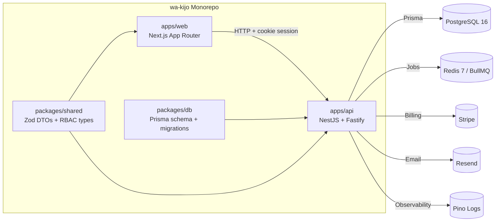
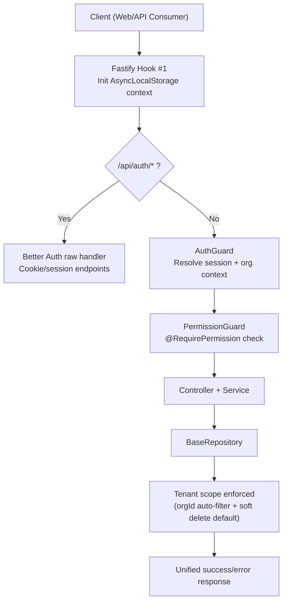
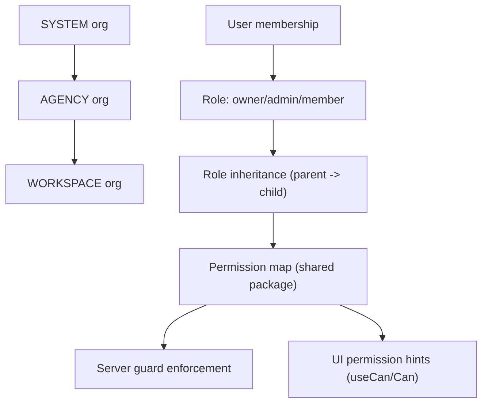
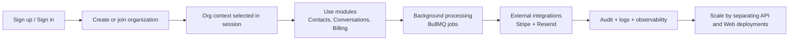

# wa'kijo Full App Infographic

This infographic summarizes the whole wa'kijo application: monorepo structure, runtime architecture, security pipeline, and product flows.

## 1) Monorepo and Runtime Map

## 2) Secure Request Lifecycle

## 3) Multi-Tenant Access Model

## 4) End-to-End Product Flow

## 5) Core Value Delivered by the App

- Enterprise-ready baseline: auth, RBAC, billing, queues, audit, and observability.
- Safe multi-tenancy by default through request context + repository-level scoping.
- Fast feature delivery via reusable shared DTOs/types across API and Web.
- Production scalability with independently deployable frontend and backend.
