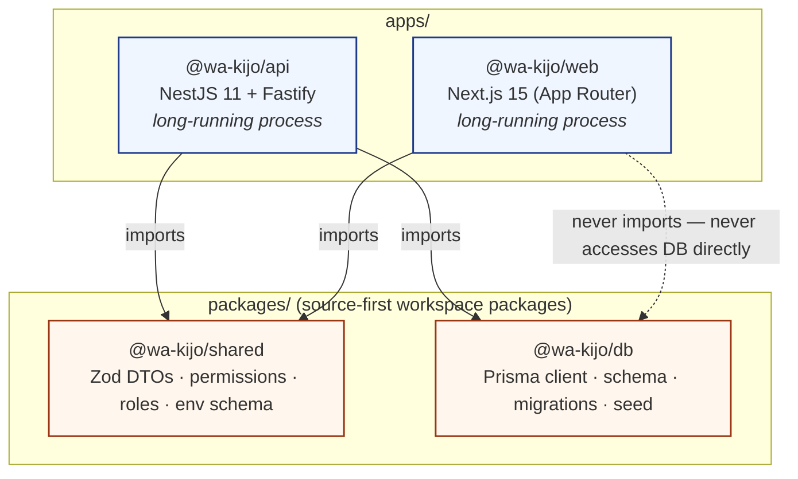
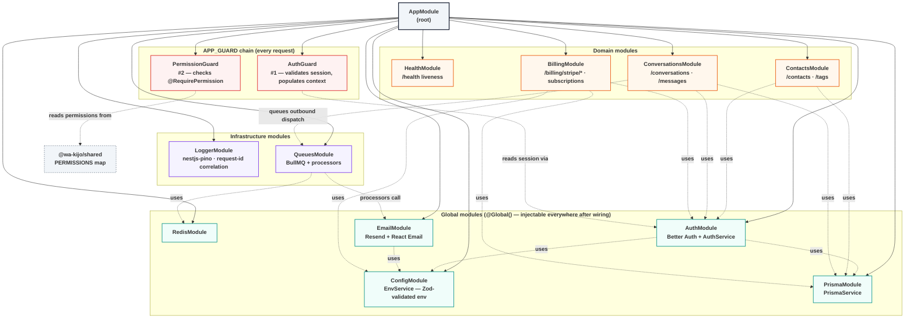
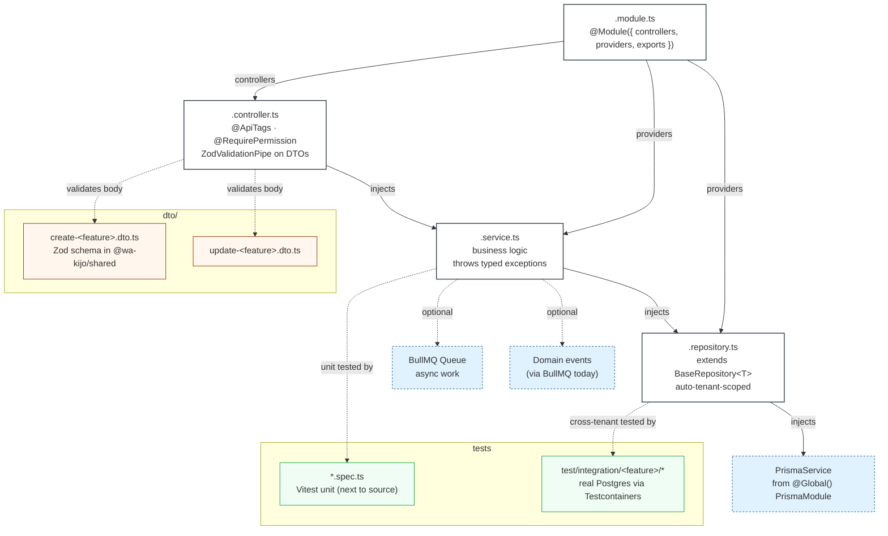
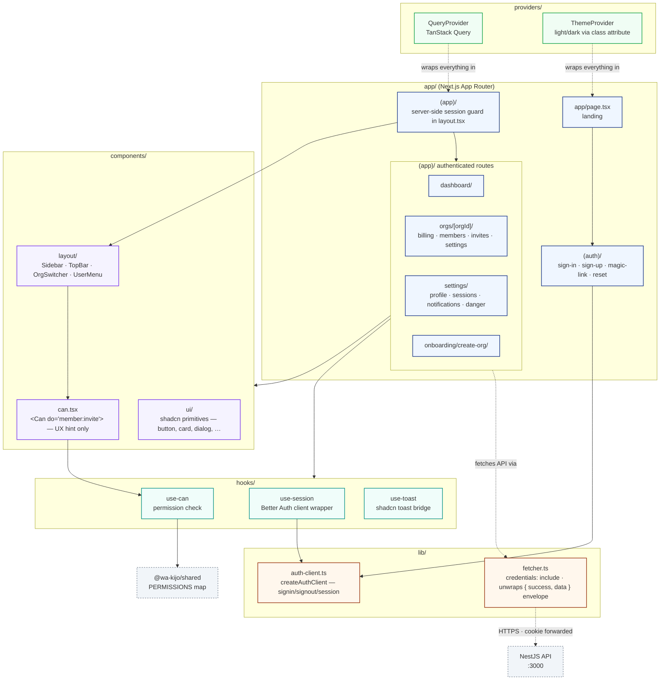

# Module map

The full wa'kijo app at four zoom levels:

1. **[Monorepo workspace](#1-monorepo-workspace)** — which packages exist and how they depend on each other.
2. **[API NestJS module graph](#2-api-nestjs-module-graph)** — every module wired into `AppModule`, with `@Global()` modules called out and the APP_GUARD chain.
3. **[Inside a feature module](#3-inside-a-feature-module)** — the canonical file layout every new feature should copy.
4. **[Web app structure](#4-web-app-structure)** — Next.js routes, components, hooks, and how they reach the API.

Plus a **[reference table](#module-reference-table)** listing every module and its responsibility.

For the request-time view of how a single HTTP call travels through these modules, see [`service-flow.md`](service-flow.md). For deployment topology, see [`server-architecture.md`](server-architecture.md).

---

## 1. Monorepo workspace



**Key invariant:** `apps/web` **never** imports `@wa-kijo/db` directly — it only talks to the API over HTTP. This keeps the frontend safely decoupled from Prisma and the database schema. The shared package is the only thing both apps depend on.

---

## 2. API NestJS module graph

Every box is a NestJS `@Module`. Solid arrows are explicit `imports: […]`; the `APP_GUARD` chain at the bottom is the global request-time pipeline.



**Reading the graph:**

- Solid arrows from `AppModule` → registration order in `apps/api/src/app.module.ts`. The order matters slightly: `ConfigModule` first (everything else reads env), then `Prisma`/`Redis` (data clients), then global services, then domain modules.
- Dotted arrows = runtime dependency (one module's service injected into another). These are not explicit `imports`; they're resolved by NestJS's DI graph because the providing module is `@Global()`.
- The two `APP_GUARD` providers run on every request unless `@Public()` is applied. They are the request-time enforcement layer in front of every controller.

---

## 3. Inside a feature module

The canonical layout every feature module follows. Copy `contacts/` as the reference when scaffolding a new one.



**Rules of the road:**

- **Controller is pure routing.** Parse the DTO, delegate to the service, return the value. No business logic, no Prisma calls.
- **Service is business logic.** Uses the repository for persistence; throws `BadRequestException` / `NotFoundException` / etc. for error cases; emits BullMQ jobs for async work.
- **Repository extends `BaseRepository<T>`.** Tenant scoping (`where: { organizationId: ctx.orgId }`) and soft-delete filtering (`where: { deletedAt: null }`) are automatic. Direct `prisma.<model>.findMany` calls outside `BaseRepository` are forbidden except for explicit `// EXEMPT: <reason>` cases.
- **DTOs live in `@wa-kijo/shared`** so the frontend uses the exact same Zod schema for its forms. Single source of truth for types.
- **Tests next to source.** `contacts.service.spec.ts` lives next to `contacts.service.ts`. Cross-tenant isolation integration tests live in `apps/api/test/integration/<feature>/`.

---

## 4. Web app structure



**Server vs client component decisions:** the route-group `layout.tsx` files are server components — they fetch the session server-side via `getSession({ fetchOptions: { headers: await headers() } })` for the initial guard. Forms, dialogs, and any component that uses TanStack Query are `'use client'`. `<Can>` and `useCan()` are client-side UX hints only — they read the same permission catalogue but the **server `@RequirePermission` is the security boundary**.

---

## Module reference table

| Module | Source | Public surface | Depends on | Tests |
|---|---|---|---|---|
| `AppModule` | `apps/api/src/app.module.ts` | Composes everything below | — | — |
| `ConfigModule` (@Global) | `apps/api/src/config/` | `EnvService.get(key)` | `@wa-kijo/shared` env schema | — |
| `LoggerModule` | `nestjs-pino` (third-party) | `Logger` injection | `ConfigModule` (for log level) | — |
| `PrismaModule` (@Global) | `apps/api/src/prisma/` | `PrismaService` | `@wa-kijo/db` | — |
| `RedisModule` (@Global) | `apps/api/src/redis/` | `IoRedis` client | env: `REDIS_URL` | — |
| `AuthModule` (@Global) | `apps/api/src/auth/` | `BETTER_AUTH` token, `AuthService` | Prisma, Config, Email | unit |
| `EmailModule` (@Global) | `apps/api/src/modules/email/` | `EmailService.send(template, …)` | Config, Resend | unit |
| `QueuesModule` | `apps/api/src/queues/` | `JOB_QUEUE` tokens, processors | Redis, Email | unit |
| `HealthModule` | `apps/api/src/modules/health/` | `GET /health` — liveness + Postgres + Redis ping | Prisma, Redis | unit |
| `ContactsModule` | `apps/api/src/modules/contacts/` | `GET/POST/PUT/DELETE /contacts`, `GET/POST/PUT/DELETE /tags`, `POST /contacts/bulk-import` | Prisma, Auth | unit + integration |
| `ConversationsModule` | `apps/api/src/modules/conversations/` | `/conversations`, `/conversations/:id/messages`, state machine | Prisma, Auth, Queues | unit + integration |
| `BillingModule` | `apps/api/src/modules/billing/` | `GET /billing/plans`, `GET /billing/subscription`, `POST /billing/stripe/checkout`, `POST /billing/stripe/portal`, `POST /billing/stripe/webhook` | Prisma, Auth, Config | unit |
| **`AuthGuard`** (APP_GUARD) | `apps/api/src/common/guards/auth.guard.ts` | Wraps every route — `@Public()` opts out | AuthModule | unit |
| **`PermissionGuard`** (APP_GUARD) | `apps/api/src/common/guards/permission.guard.ts` | `@RequirePermission('resource:action')` enforcement | `@wa-kijo/shared` PERMISSIONS | unit |
| **`TransformInterceptor`** | `apps/api/src/common/interceptors/transform.interceptor.ts` | Wraps success responses as `{ success, data, timestamp }` | — | — |
| **`HttpExceptionFilter`** | `apps/api/src/common/filters/http-exception.filter.ts` | Maps exceptions → `{ success: false, error, message, statusCode }`. Prisma error → HTTP code mapping. | — | — |

---

## Adding a new module — checklist

```
- [ ] Prisma model in packages/db/prisma/schema.prisma + migration
- [ ] Zod DTO in packages/shared/src/dto/<feature>.ts (pnpm --filter @wa-kijo/shared build)
- [ ] apps/api/src/modules/<feature>/
      ├── <feature>.module.ts
      ├── <feature>.controller.ts   (@ApiTags + @RequirePermission)
      ├── <feature>.service.ts
      └── <feature>.repository.ts   (extends BaseRepository<T>)
- [ ] Permission entries in packages/shared/src/auth/permissions.ts
- [ ] Module imported in apps/api/src/app.module.ts
- [ ] Unit tests next to each file (*.spec.ts)
- [ ] Cross-tenant isolation test in apps/api/test/integration/<feature>/
- [ ] CHANGELOG.md entry under [Unreleased]
```

The `contacts/` module is the canonical reference — copy its structure for the cleanest pattern.
