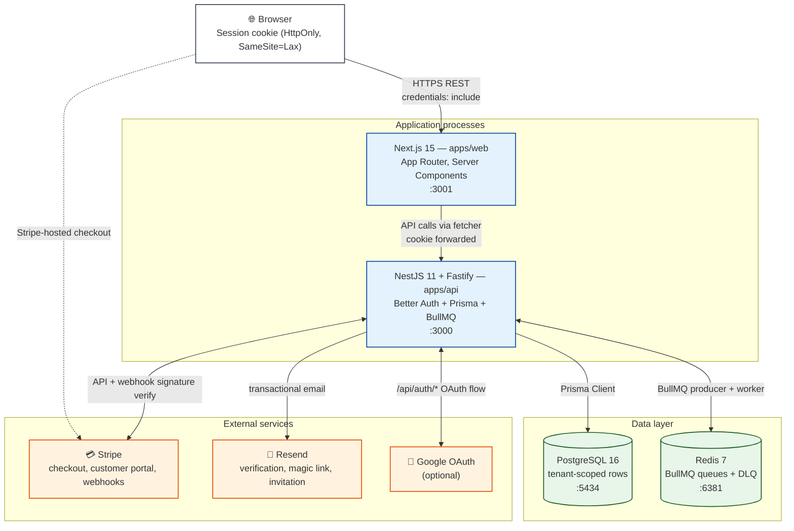

# Server architecture

The deployment topology of a typical wa'kijo install. Two long-running processes
(`apps/api` and `apps/web`), two data stores (Postgres 16 + Redis 7), and three
external SaaS dependencies (Stripe, Resend, Google OAuth). The ports shown are
the local-dev defaults from `.env.example`; production deployments typically
front everything with a reverse proxy on 80/443.



## Key properties

- **Stateless application processes** — the API and web app hold no session
  state in-process. Sessions are in the Postgres `Session` table (Better Auth)
  and the cookie is the only client-side artifact. You can run N replicas of
  either process behind a load balancer with no sticky sessions required.
- **Postgres is the source of truth for tenancy.** Every row in a tenant-scoped
  table has an `organizationId`. `BaseRepository<T>` enforces filtering by the
  active org from the `AsyncLocalStorage` request context.
- **Redis is ephemeral.** BullMQ stores queue state there; if Redis is wiped,
  in-flight jobs are lost. The DLQ partition keeps terminally failed jobs for
  manual inspection. Use a managed Redis with persistence in production.
- **Stripe is the only payment provider built in.** The `BillingProvider`
  interface is generic so additional providers (Billplz, Curlec, etc.) can be
  plugged in without changing `BillingService`.
- **OAuth is opt-in.** Set `GOOGLE_CLIENT_ID` + `GOOGLE_CLIENT_SECRET` in `.env`
  to enable it; absent vars disable the Google sign-in button cleanly.

## Production deployment shape

A minimum-viable production deployment looks like:

```
              ┌──────────────────────────┐
              │  Reverse proxy / CDN     │
              │  (Caddy, nginx, Cloudflare)
              └─────┬───────────┬────────┘
                    │           │
              :3001 │           │ :3000
            ┌───────▼──┐      ┌─▼─────────┐
            │ apps/web │      │ apps/api  │  ← horizontal scale
            └──────────┘      └─┬──────┬──┘
                                │      │
                  ┌─────────────▼─┐  ┌─▼─────────┐
                  │ Postgres 16   │  │ Redis 7   │
                  │ (managed)     │  │ (managed) │
                  └───────────────┘  └───────────┘
```

Recommended platforms: Railway, Fly.io, AWS (ECS Fargate + RDS + ElastiCache),
or self-hosted Docker Compose. See `docs/deployment.md` for per-platform
recipes.
