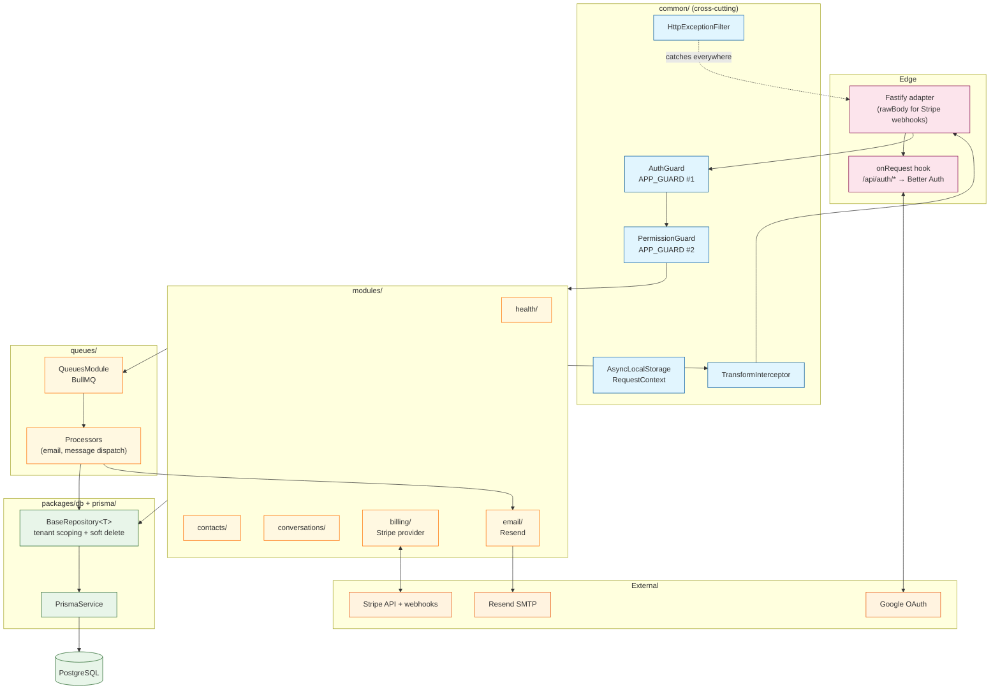

# Service flow

How a single authenticated HTTP request flows through the wa'kijo API, from the
Fastify entry point down to the database and back. This is the most important
diagram to internalise before contributing — every NestJS feature module hooks
into this same skeleton.

## Request lifecycle

```mermaid
sequenceDiagram
    participant C as Client
    participant F as Fastify
    participant BA as Better Auth<br/>(/api/auth/*)
    participant ALS as AsyncLocalStorage<br/>RequestContext
    participant AG as AuthGuard
    participant PG as PermissionGuard
    participant Ctrl as Controller
    participant Svc as Service
    participant BR as BaseRepository&lt;T&gt;
    participant TI as TransformInterceptor
    participant DB as PostgreSQL

    C->>F: HTTP request (session cookie)

    Note over F,ALS: onRequest hook #1
    F->>ALS: run { requestId, userId:"", orgId:"" }

    Note over F,BA: onRequest hook #2 — Better Auth catches /api/auth/*
    alt /api/auth/* (signin, signup, magic-link, oauth)
        F->>BA: handle raw request stream
        BA-->>F: response
        F-->>C: response
    else everything else (the NestJS pipeline)
        F->>AG: APP_GUARD #1
        AG->>BA: validate session cookie
        AG->>ALS: populate { userId, orgId, orgType, userRole }
        AG->>PG: pass

        PG->>PG: read @RequirePermission metadata
        PG->>PG: PERMISSIONS[key].includes(ctx.userRole)?
        alt has permission
            PG->>Ctrl: invoke route handler
            Ctrl->>Svc: business logic
            Svc->>BR: findMany / create / update / delete
            BR->>BR: auto-scope by ctx.orgId<br/>filter deletedAt: null
            BR->>DB: parameterised SQL (Prisma)
            DB-->>BR: rows
            BR-->>Svc: typed entities
            Svc-->>Ctrl: result
            Ctrl-->>TI: return value

            TI->>TI: wrap as<br/>{ success: true, data, timestamp }
            TI-->>F: envelope
            F-->>C: 200 / 201 + JSON
        else missing permission
            PG-->>F: 403 Forbidden
            F-->>C: HttpExceptionFilter envelope
        end
    end
```

## Component diagram

The same flow as a layered component view — useful when you're navigating the
codebase.



## What to know about each hop

| Hop                      | File                                                        | What it does                                                                                                                                                                                                                                                                                                                               |
| ------------------------ | ----------------------------------------------------------- | ------------------------------------------------------------------------------------------------------------------------------------------------------------------------------------------------------------------------------------------------------------------------------------------------------------------------------------------ |
| **Fastify onRequest #1** | `apps/api/src/main.ts`                                      | Starts an `AsyncLocalStorage.run` so the entire downstream call chain shares one `RequestContext`.                                                                                                                                                                                                                                         |
| **Fastify onRequest #2** | `apps/api/src/main.ts`                                      | Routes `/api/auth/*` to Better Auth's raw-stream handler, bypassing the NestJS pipeline so Better Auth can read the body itself.                                                                                                                                                                                                           |
| **AuthGuard**            | `apps/api/src/common/guards/auth.guard.ts`                  | Validates the session cookie via Better Auth. Calls `AuthService.resolveContext()` to populate the AsyncLocalStorage store with `userId`, `orgId`, `orgType`, and the effective `userRole` (which is the inherited role from the role-inheritance chain — owner of a parent AGENCY inherits owner of every child WORKSPACE up to depth 3). |
| **PermissionGuard**      | `apps/api/src/common/guards/permission.guard.ts`            | Reads `@RequirePermission('resource:action')` metadata on the route. Looks up the permission in the static `PERMISSIONS` map from `@wa-kijo/shared` and checks whether the resolved role is in the allowed list.                                                                                                                           |
| **Controller**           | `apps/api/src/modules/<feature>/*.controller.ts`            | Pure routing — parses DTOs (via `ZodValidationPipe`), delegates to the service, returns the value. No business logic.                                                                                                                                                                                                                      |
| **Service**              | `apps/api/src/modules/<feature>/*.service.ts`               | Business logic. Uses the repository for persistence; emits BullMQ jobs for async work; throws typed NestJS exceptions for error cases.                                                                                                                                                                                                     |
| **BaseRepository<T>**    | `apps/api/src/base/base.repository.ts`                      | Generic tenant-scoped Prisma wrapper. `findMany` automatically appends `where: { organizationId: ctx.orgId, deletedAt: null }`. Override with `{ includeDeleted: true }` if you really need to.                                                                                                                                            |
| **TransformInterceptor** | `apps/api/src/common/interceptors/transform.interceptor.ts` | Wraps every non-error response as `{ success: true, data, timestamp }`. The web `fetcher` unwraps this.                                                                                                                                                                                                                                    |
| **HttpExceptionFilter**  | `apps/api/src/common/filters/http-exception.filter.ts`      | Catches every thrown exception and maps to `{ success: false, statusCode, error, message, timestamp, path }`. Maps Prisma `P2002` → 409, `P2025` → 404, etc.                                                                                                                                                                               |

## What you must NOT do

- Don't call `prisma.<model>.findMany` directly outside `BaseRepository` — it
  bypasses tenant scoping. The only exemptions are system-level queries (admin,
  billing webhooks) and they need an explicit `// EXEMPT: <reason>` comment plus
  a tenant-scoping unit test.
- Don't read `userId` / `orgId` from the request object — use
  `getRequestContext()` from `common/context/request-context.ts`. Same data, but
  the AsyncLocalStorage path works in any service / repository call regardless
  of how deep in the call chain it is.
- Don't omit `@RequirePermission` on a controller method assuming "it's only
  admin." Routes without the decorator are open to any authenticated user. Make
  every authorisation decision explicit.
